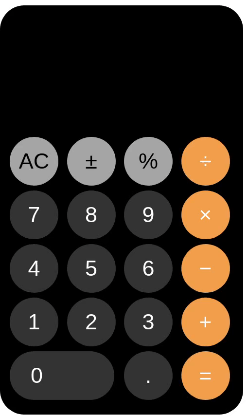

# Calculator

## Description

Project aims to create a calculator app.

## Problem Statement

- Your company has recently started on a project that aims to create a calculator. So you and your colleagues have started to work on the project.

## Expected Outcome

## Objective

Build a Calculator that is functionally similar to an ios device calculator.

### At the end of the project, following topics are to be covered;

- HTML

- SASS/SCSS

- JS

### At the end of the project, students will be able to;

- improve coding skills within HTML & SASS/SCSS & JS(OOP)

- use git commands (push, pull, commit, add etc.) and Github as Version Control System.

## Steps to Solution

- Step 1: Download or clone project repo on Github

- Step 2: Create project folder for local public repo on your pc

- Step 3: Create a ios calculator.

> > Part-1 HTML Structure

    - Creat structure of the HTML5
    - Give name of your project (title)
    - Create the main structur of the HTML

> > Part-2 SCSS Structure

    - Set a folder structure and define the variables
    - Set a background
    - Set container background color and margin
    - Define others grid-size etc...

> Part-3 JS Structure

    - Create code for calculator

- Step 4: Push your application into your own public repo on Github
